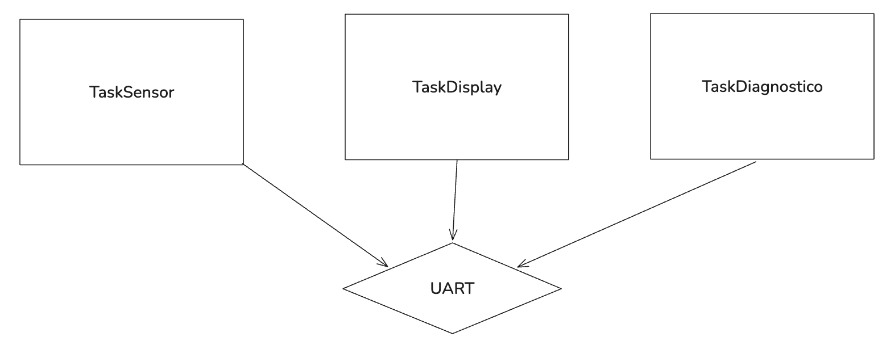

# Atividade 1 — Quem deve executar primeiro?

## 1. Objetivo

Investigar o efeito das prioridades e do bloqueio voluntário no escalonamento de três tarefas.

## 2. Diagrama



## 3. Implementação e experimentos

### Experimento A - Prioridades iguais

```c
void TaskSensor_fun(void *argument)
{
  /* USER CODE BEGIN 5 */
  /* Infinite loop */
  for(;;)
  {
	printf("[%lu ms] TaskSensor ON\r\n", osKernelGetTickCount());
  }
  /* USER CODE END 5 */
}
```

```c
void TaskDisplay_fun(void *argument)
{
  /* USER CODE BEGIN TaskDisplay_fun */
  /* Infinite loop */
  for(;;)
  {
    printf("[%lu ms] TaskDisplay ON\r\n", osKernelGetTickCount());

  }
  /* USER CODE END TaskDisplay_fun */
}
```

```c
void TaskDiagnostico_fun(void *argument)
{
  /* USER CODE BEGIN TaskDiagnostico_fun */
  /* Infinite loop */
  for(;;)
  {
	printf("[%lu ms] TaskDiagnostico ON\r\n", osKernelGetTickCount());
	//osDelay(2500);
  }
  /* USER CODE END TaskDiagnostico_fun */
}
```

**Saída registrada:**

```text
TaskDiagnostico ON
TaskDiagnostico ON
TaskDiagnostico ON
TaskDiagnostico ON
TaskDiagnostico ON
…

[0 ms] TaskDisplay ONy ON
ON
[5 ms] TaskDisplay ON
6 ms] TaskDiagnostico ON
[[7 ms] TaskDisplay ON
 ON
[[24 ms] TasDisplay ON
 ON
[[30 ms] askDisplay ON
 ON
[[36 m] TaskDisplay ON
 ON
[[4 ms] TaskDisplay ON
 ON
[[51 ms] Taskisplay ON
 ON
[57 ms] TaskDisplay ON
ON
[63 ms] TaskDisplay ON
ON
[69 ms] TaskDisplay ON
ON
[75 ms] TaskDisplay ON
ON
[83 ms] TaskDisplay ON
6 ms] TaskDisplay ON
o ON
[95[96 ms] Taisplay ON
co ON
[[102 ms TaskDisplay ON
or ON[107 ms] TaskDisplay ON
ay ONens[116[117 maskDisplay ON
N
TaskD[125 ms] TaskDisplay ON
play ON
TaskDiagnostico ON
[137 ms] TaskDisplay ON
[138 ms] TaskDsplay ON
 ON
[149 [150 mskDisplay ON
ON
 ON
[158 ms] TaskDisplay ON
N
iaskSensor ON
[168 ms] TaskDisplay ON
[174 ms] TaskDisplay ON
askS[[180 s] TaskDisplay ON
81 ms[[88 ms] TaskDisplay ON
skDis[195 ms] TaskDisplay ON
 Tas[[201 ms TaskDisplay ON
00 ms[207 ms] TaskDisplay ON
```

No trecho registrado, somente a mensagem de `TaskDiagnostico` aparece no terminal, porém a mesma se encontra "atropelada" como se a UART não conseguisse acompanhar o volume de mensagens a serem enviadas.

### Experimento B - Prioridades diferentes

**Saída registrada:**

```text
[0 ms] TaskSensor ON
[1 ms] TaskSensor ON
[3 ms] TaskSensor ON
[5 ms] TaskSensor ON
[7 ms] TaskSensor ON
[9 ms] TaskSensor ON
[11 ms] TaskSensor ON
[13 ms] TaskSensor ON
[15 ms] TaskSensor ON
[17 ms] TaskSensor ON
[19 ms] TaskSensor ON
[21 ms] TaskSensor ON
[23 ms] TaskSensor ON
[25 ms] TaskSensor ON
[27 ms] TaskSensor ON
[29 ms] TaskSensor ON
[31 ms] TaskSensor ON
[33 ms] TaskSensor ON
[35 ms] TaskSensor ON
[37 ms] TaskSensor ON
[39 ms] TaskSensor ON
[41 ms] TaskSensor ON
[43 ms] TaskSensor ON
[45 ms] TaskSensor ON
[47 ms] TaskSensor ON
[49 ms] TaskSensor ON
[51 ms] TaskSensor ON
[53 ms] TaskSensor ON
[55 ms] TaskSensor ON
[57 ms] TaskSensor ON
[59 ms] TaskSensor ON
[61 ms] TaskSensor ON
[63 ms] TaskSensor ON
[65 ms] TaskSensor ON
[67 ms] TaskSensor ON
[69 ms] TaskSensor ON
[71 ms] TaskSensor ON
[74 ms] TaskSensor ON
[76 ms] TaskSensor ON
[78 ms] TaskSensor ON
[80 ms] TaskSensor ON
[82 ms] TaskSensor ON
[84 ms] TaskSensor ON
[86 ms] TaskSensor ON
[88 ms] TaskSensor ON
[90 ms] TaskSensor ON
[92 ms] TaskSensor ON
[94 ms] TaskSensor ON
[96 ms] TaskSensor ON
[98 ms] TaskSensor ON
[100 ms] TaskSensor ON
[102 ms] TaskSensor ON
[104 ms] TaskSensor ON
[106 ms] TaskSensor ON
[108 ms] TaskSensor ON
[110 ms] TaskSensor ON
[112 ms] TaskSensor ON
[114 ms] TaskSensor ON
[116 ms] TaskSensor ON
[119 ms] TaskSensor ON
[121 ms] TaskSensor ON
[123 ms] TaskSensor ON
[125 ms] TaskSensor ON

…
```

No trecho registrado, somente a mensagem de `TaskSensor` aparece no terminal. A tarefa foi configurada com prioridade superior às demais.

### Experimento C - Bloqueio voluntário

```c
void TaskSensor_fun(void *argument)
{
  /* USER CODE BEGIN 5 */
  /* Infinite loop */
  for(;;)
  {
	printf("[%lu ms] TaskSensor ON\r\n", osKernelGetTickCount());
	osDelay(1000);
  }
  /* USER CODE END 5 */
}
```

```c
void TaskDisplay_fun(void *argument)
{
  /* USER CODE BEGIN TaskDisplay_fun */
  /* Infinite loop */
  for(;;)
  {
    printf("[%lu ms] TaskDisplay ON\r\n", osKernelGetTickCount());
	osDelay(1000);

  }
  /* USER CODE END TaskDisplay_fun */
}

```

```c
void TaskDiagnostico_fun(void *argument)
{
  /* USER CODE BEGIN TaskDiagnostico_fun */
  /* Infinite loop */
  for(;;)
  {
	printf("[%lu ms] TaskDiagnostico ON\r\n", osKernelGetTickCount());
	osDelay(1000);
  }
  /* USER CODE END TaskDiagnostico_fun */
}
```


### Prioridades iguais

**Saída registrada:**

```text
[1001 ms] TaskDiagnostico[2002 ms] TaskSensor ON
 [3003 ms] TaskDisplay ON
ON
[4004 ms] TaskDiagnostico[5005 ms] TaskSensor ON
 [6006 ms] TaskDisplay ON
ON
[7007 ms] TaskDiagnostico[8008 ms] TaskSensor ON
 [9009 ms] TaskDisplay ON
ON
[10010 ms] TaskDiagnostico[11011 ms] TaskSensor ON
 [12012 ms] TaskDisplay ON
ON
[13013 ms] TaskDiagnostico[14014 ms] TaskSensor ON
 [15015 ms] TaskDisplay ON
ON
[16016 ms] TaskDiagnostico[17017 ms] TaskSensor ON
 [18018 ms] TaskDisplay ON
ON
[19019 ms] TaskDiagnostico[20020 ms] TaskSensor ON
 [21021 ms] TaskDisplay ON
ON
[22022 ms] TaskDiagnostico[23023 ms] TaskSensor ON
 [24024 ms] TaskDisplay ON
ON
[25025 ms] TaskDiagnostico[26026 ms] TaskSensor ON
 [27027 ms] TaskDisplay ON
ON
[28028 ms] TaskDiagnostico[29029 ms] TaskSensor ON
 [30030 ms] TaskDisplay ON
ON
[31031 ms] TaskDiagnostico[32032 ms] TaskSensor ON
 [33033 ms] TaskDisplay ON
ON
[34034 ms] TaskDiagnostico[35035 ms] TaskSensor ON
 [36036 ms] TaskDisplay ON
ON
[37037 ms] TaskDiagnostico[38038 ms] TaskSensor ON
 [39039 ms] TaskDisplay ON
ON
[40040 ms] TaskDiagnostico[41041 ms] TaskSensor ON
 [42042 ms] TaskDisplay ON
ON

```

O trecho mostra a sequência `TaskSensor → TaskDisplay → TaskDiagnostico`. Porém, a mensagem aparece "atropelada". É evidente que somente uma task tem acesso à UART a cada intervalo de 1 segundo. 

### Prioridades diferentes

**Saída registrada:**

```text
[0 ms] TaskSensor ON
[1 ms] TaskDisplay ON
[3 ms] TaskDiagnostico ON
[1001 ms] TaskSensor ON
[1003 ms] TaskDisplay ON
[1006 ms] TaskDiagnostico ON
[2003 ms] TaskSensor ON
[2005 ms] TaskDisplay ON
[2008 ms] TaskDiagnostico ON
[3005 ms] TaskSensor ON
[3007 ms] TaskDisplay ON
[3010 ms] TaskDiagnostico ON
[4007 ms] TaskSensor ON
[4009 ms] TaskDisplay ON
[4012 ms] TaskDiagnostico ON
[5009 ms] TaskSensor ON
[5011 ms] TaskDisplay ON
[5014 ms] TaskDiagnostico ON
[6011 ms] TaskSensor ON
[6013 ms] TaskDisplay ON
[6016 ms] TaskDiagnostico ON
[7013 ms] TaskSensor ON
[7015 ms] TaskDisplay ON
[7018 ms] TaskDiagnostico ON
[8015 ms] TaskSensor ON
[8017 ms] TaskDisplay ON
[8020 ms] TaskDiagnostico ON

…
```

O trecho mostra grupos de mensagens na ordem apresentada. A cada intervalo de 1 segundo, as 3 tasks fazem uso da UART, transmitindo as mensagens na sequência `TaskSensor → TaskDisplay → TaskDiagnostico`

### Seguindo prioridades e valores de osDelay distintos

- `TaskSensor -> osDelay(300), osPriorityHigh`

- `TaskDisplay -> osDelay(1000), osPriorityNormal`

- `TaskDiagnostico -> osDelay(2500), osPriorityLow`

**Saída registrada:**

```text
[0 ms] TaskSensor ON
[1 ms] TaskDisplay ON
[3 ms] TaskDiagnostico ON
[301 ms] TaskSensor ON
[603 ms] TaskSensor ON
[905 ms] TaskSensor ON
[1003 ms] TaskDisplay ON
[1207 ms] TaskSensor ON
[1509 ms] TaskSensor ON
[1811 ms] TaskSensor ON
[2005 ms] TaskDisplay ON
[2113 ms] TaskSensor ON
[2415 ms] TaskSensor ON
[2506 ms] TaskDiagnostico ON
[2717 ms] TaskSensor ON
[3007 ms] TaskDisplay ON
[3019 ms] TaskSensor ON
[3321 ms] TaskSensor ON
[3623 ms] TaskSensor ON
[3925 ms] TaskSensor ON
[4009 ms] TaskDisplay ON
[4227 ms] TaskSensor ON
[4529 ms] TaskSensor ON
[4831 ms] TaskSensor ON
[5008 ms] TaskDiagnostico ON
[5011 ms] TaskDisplay ON
[5133 ms] TaskSensor ON
[5435 ms] TaskSensor ON
[5737 ms] TaskSensor ON

```


## 5. Análise dos resultados

**Questão:** Aumentar a prioridade de uma tarefa significa necessariamente que ela executará mais vezes? Explique utilizando os estados Running, Ready e Blocked.

Não necessariamente. A prioridade influencia a seleção de uma tarefa que está em **Ready** para ocupar a CPU e entrar em **Running**. Uma tarefa de prioridade alta pode executar menos vezes que outra de prioridade baixa se permanecer por mais tempo em **Blocked**, aguardando um atraso ou a disponibilidade de um recurso. Por isso, a quantidade de execuções também depende do comportamento de cada tarefa.