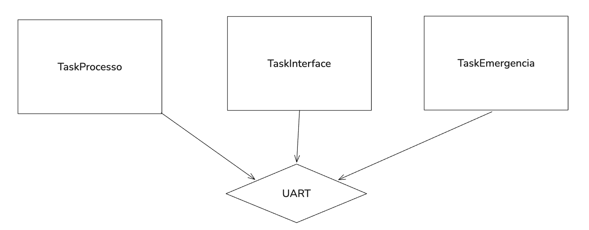

# Atividade 2 — Atendimento de uma situação crítica

## 1. Objetivo

Investigar a influência da prioridade de uma tarefa de emergência e da carga de CPU sobre seu atendimento.

## 2. Diagrama



## 3. Implementação e experimentos

Para simular uma task de uso intensivo de CPU, foi implementado um laço for de contagem até 50 milhões.

```c
void TaskProcesso_fun(void *argument)
{
  /* USER CODE BEGIN 5 */
  /* Infinite loop */
  volatile uint32_t contador = 0;
  for(;;)
  {
	  for(uint32_t i = 0; i < 50000000; i++){
		  contador++;
	  }
	  uint32_t tick_atual = osKernelGetTickCount();
	  printf("[%lu ms] TaskProcesso: Encerrado ciclo de contagem\r\n", tick_atual);
  }
  /* USER CODE END 5 */
}
```

```c
void TaskInterface_fun(void *argument)
{
  /* USER CODE BEGIN TaskInterface_fun */
  /* Infinite loop */
  for(;;)
  {
	uint32_t tick_atual = osKernelGetTickCount();
	printf("[%lu ms] TaskInterface: Atualizando interface!\r\n", tick_atual);
	osDelay(1000);
  }
  /* USER CODE END TaskInterface_fun */
}
```

```c
void TaskEmergencia_fun(void *argument)
{
  /* USER CODE BEGIN TaskEmergencia_fun */
  /* Infinite loop */
  for(;;)
  {
	uint32_t tick_atual = osKernelGetTickCount();
	printf("[%lu ms] TaskEmergencia: Emergencia simulada!\r\n", tick_atual);
	osDelay(2500);
  }
  /* USER CODE END TaskEmergencia_fun */
}
```


### Mesma prioridade

```text
[1002 ms] TaskInterface: Atualizando interface!
[2008 ms] TaskInterface: Atualizando interface!
[2506 ms] TaskEmergencia: Emergencia simulada!
[3014 ms] TaskInterface: Atualizando interface!
[4020 ms] TaskInterface: Atualizando interface!
[5012 ms] TaskEmergencia: Emergencia simulada!
[5026 ms] TaskInterface: Atualizando interface!
[5105 ms] TaskProcesso: Encerrado ciclo de contagem
[6032 ms] TaskInterface: Atualizando interface!
[7038 ms] TaskInterface: Atualizando interface!
[7518 ms] TaskEmergencia: Emergencia simulada!
[8044 ms] TaskInterface: Atualizando interface!
```

### TaskEmergencia com prioridade LOW

```text
[1006 ms] TaskInterface: Atualizando interface!
[2012 ms] TaskInterface: Atualizando interface!
[3018 ms] TaskInterface: Atualizando interface!
[4024 ms] TaskInterface: Atualizando interface!
[5030 ms] TaskInterface: Atualizando interface!
[5097 ms] TaskProcesso: Encerrado ciclo de contagem
[6036 ms] TaskInterface: Atualizando interface!
[7042 ms] TaskInterface: Atualizando interface!
[8048 ms] TaskInterface: Atualizando interface!
[9054 ms] TaskInterface: Atualizando interface!
[10060 ms] TaskInterface: Atualizando interface!
[10196 ms] TaskProcesso: Encerrado ciclo de contagem
```

Nenhuma mensagem de `TaskEmergencia` aparece no trecho registrado para prioridade LOW.

### TaskEmergencia com prioridade HIGH

```text
[1010 ms] TaskInterface: Atualizando interface!
[2016 ms] TaskInterface: Atualizando interface!
[2503 ms] TaskEmergencia: Emergencia simulada!
[3022 ms] TaskInterface: Atualizando interface!
[4028 ms] TaskInterface: Atualizando interface!
[5007 ms] TaskEmergencia: Emergencia simulada!
[5034 ms] TaskInterface: Atualizando interface!
[5110 ms] TaskProcesso: Encerrado ciclo de contagem
[6040 ms] TaskInterface: Atualizando interface!
[7046 ms] TaskInterface: Atualizando interface!
[7511 ms] TaskEmergencia: Emergencia simulada!
[8052 ms] TaskInterface: Atualizando interface!
```

É possível observar uma diferença sutil no tempo de resposta da `TaskEmergencia` quando esta possui prioridade maior, comparado com quando possui prioridade igual às outras tasks.

**Mesma prioridade:** 2506ms entre execuções.

**Prioridade maior:** 2503ms entre execuções.

## 4. Análise dos resultados

**Questão:** Uma tarefa possuir prioridade elevada é suficiente para garantir que ela sempre apresentará um pequeno tempo de resposta? Justifique.

Não necessariamente. Caso uma task de alta prioridade esteja bloqueada aguardando a liberação de um recurso crítico ou em ready esperando a CPU em um SO não preemptivo, não é possível garantir sua execução rapidamente.