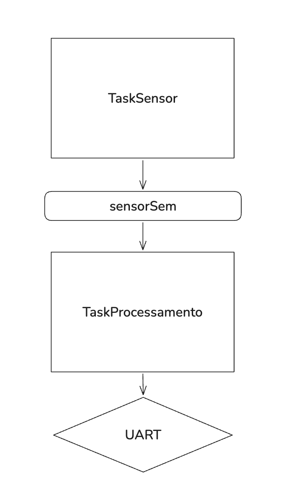

# Atividade 3 — Só processe quando houver dados

## 1. Objetivo

Comparar polling e sincronização por semáforo binário na produção e no processamento de dados.

## 2. Diagrama



## 3. Implementação e experimentos

`TaskSensor` lê o estado de do botão K1 embutido na placa STM32F407VET6, soldado ao pino PE3. Para transmitir o estado desse botão, foi utilizada uma fila de comprimento 1. `TaskSensor` deposita a leitura do botão, e `TaskProcessamento` recebe o valor, conforme os nomes empregados no código.

### Solução de polling

```c
void TaskSensor_fun(void *argument)
{
 /* USER CODE BEGIN 5 */
 uint8_t valor_sensor = 0;
 /* Infinite loop */
 for(;;)
 {
   if(HAL_GPIO_ReadPin(BTN_K1_GPIO_Port, BTN_K1_Pin)){
   	valor_sensor = 1;
   }
   else valor_sensor = 0;
   osMessageQueuePut(filaSensorHandle, &valor_sensor, 0, 0);
	  uint32_t tick_atual = osKernelGetTickCount();
	  printf("[%lu ms] TaskSensor: Enviado valor %d\r\n", tick_atual, valor_sensor);
   osDelay(100);
 }
 /* USER CODE END 5 */
}
```

```c
void TaskProcessamento_fun(void *argument)
{
 /* USER CODE BEGIN TaskProcessamento_fun */
 uint8_t valor_recebido = 0;
 /* Infinite loop */
 for(;;)
 {
   if(osMessageQueueGetCount(filaSensorHandle) != 0) {
     osMessageQueueGet(filaSensorHandle, &valor_recebido, NULL, 0);
 	  uint32_t tick_atual = osKernelGetTickCount();
 	  printf("[%lu ms] TaskProcessamento: Recebido valor: %d\r\n", tick_atual, valor_recebido);
   }
   else {
	    uint32_t tick_atual = osKernelGetTickCount();
   	printf("[%lu ms] TaskProcessamento: Nenhum valor recebido!\r\n", tick_atual);
   }
 }
 /* USER CODE END TaskProcessamento_fun */
}
```

**Saída registrada:**

```text
[500 ms] TaskSensor: Enviado valor 1
or recebido!
[504 ms] TaskProcessamento: Recebido valor: 1
[508 ms] TaskProcessamento: Nenhum valor recebido!
[513 ms] TaskProcessamento: Nenhum valor recebido!
[518 ms] TaskProcessamento: Nenhum valor recebido!
[522 ms] TaskProcessamento: Nenhum valor recebido!
[527 ms] TaskProcessamento: Nenhum valor recebido!
[531 ms] TaskProcessamento: Nenhum valor recebido!
[536 ms] TaskProcessamento: Nenhum valor recebido!
[540 ms] TaskProcessamento: Nenhum valor recebido!
[545 ms] TaskProcessamento: Nenhum valor recebido!
[549 ms] TaskProcessamento: Nenhum valor recebido!
[554 ms] TaskProcessamento: Nenhum valor recebido!
[558 ms] TaskProcessamento: Nenhum valor recebido!
[563 ms] TaskProcessamento: Nenhum valor recebido!
[568 ms] TaskProcessamento: Nenhum valor recebido!
[572 ms] TaskProcessamento: Nenhum valor recebido!
[577 ms] TaskProcessamento: Nenhum valor recebido!
[581 ms] TaskProcessamento: Nenhum valor recebido!
[586 ms] TaskProcessamento: Nenhum valor recebido!
[590 ms] TaskProcessamento: Nenhum valor recebido!
[595 ms] TaskProcessamento: Nenhum valor recebido!
[599 ms] TaskPensor: Enviado valor 1
or recebido!
[604 ms] TaskProcessamento: Recebido valor: 1
[608 ms] TaskProcessamento: Nenhum valor recebido!
[613 ms] TaskProcessamento: Nenhum valor recebido!
```

A tarefa `TaskProcessamento` desperdiça tempo de CPU verificando se a tarefa `TaskSensor` gerou um novo valor.

### Versão com o semáforo `sensorSem`

```c
void TaskSensor_fun(void *argument)
{
 /* USER CODE BEGIN 5 */
 uint8_t valor_sensor = 0;
 /* Infinite loop */
 for(;;)
 {
   if(HAL_GPIO_ReadPin(BTN_K1_GPIO_Port, BTN_K1_Pin)){
   	valor_sensor = 1;
   }
   else valor_sensor = 0;
   osMessageQueuePut(filaSensorHandle, &valor_sensor, 0, 0);
	uint32_t tick_atual = osKernelGetTickCount();
	printf("[%lu ms] TaskSensor: Enviado valor %d\r\n", tick_atual, valor_sensor);
	osSemaphoreRelease(sensorSemHandle);
   osDelay(100);
 }
 /* USER CODE END 5 */
}
```

```c
void TaskProcessamento_fun(void *argument)
{
 /* USER CODE BEGIN TaskProcessamento_fun */
 uint8_t valor_recebido = 0;
 /* Infinite loop */
 for(;;)
 {
     osMessageQueueGet(filaSensorHandle, &valor_recebido, NULL, 0);
 	  uint32_t tick_atual = osKernelGetTickCount();
 	  printf("[%lu ms] TaskProcessamento: Recebido valor: %d\r\n", tick_atual, valor_recebido);
 	  osSemaphoreAcquire(sensorSemHandle, osWaitForever);
 }
 /* USER CODE END TaskProcessamento_fun */
}
```

**Saída registrada:**

```text
…
[3191 ms] TaskSensor: Enviado valor 1
[3194 ms] TaskProcessamento: Recebido valor: 1
[3294 ms] TaskSensor: Enviado valor 1
[3297 ms] TaskProcessamento: Recebido valor: 1
[3397 ms] TaskSensor: Enviado valor 1
[3400 ms] TaskProcessamento: Recebido valor: 1
[3500 ms] TaskSensor: Enviado valor 1
[3503 ms] TaskProcessamento: Recebido valor: 1
[3603 ms] TaskSensor: Enviado valor 0
[3606 ms] TaskProcessamento: Recebido valor: 0
[3706 ms] TaskSensor: Enviado valor 0
```

No trecho registrado, as mensagens de `TaskProcessamento` acompanham as mensagens de produção. A ordem da espera pelo semáforo precisa ser revisada no código apresentado; consultar as pendências desta atividade.

## 4. Análise dos resultados

**Questão:** Compare as soluções com polling e semáforo. Qual delas utiliza melhor os recursos do sistema operacional? Explique.

No registro de polling, a tarefa de processamento realiza verificações repetidas e emite mensagens quando não há dados. No registro com semáforo, as mensagens de processamento acompanham as mensagens do produtor. Dessa forma, não consome processamento do SO desnecessariamente.