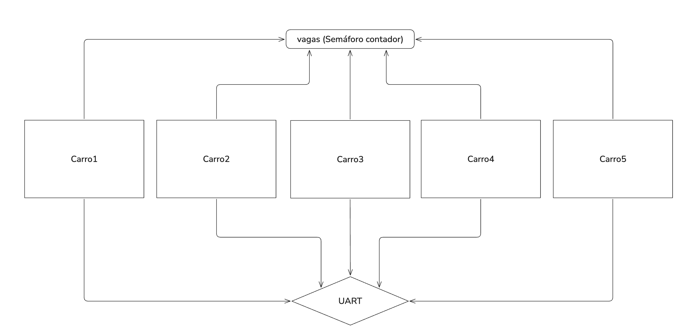

# Atividade 4 — Recursos limitados

## 1. Objetivo

Representar a disponibilidade de vagas de estacionamento com um semáforo contador.

## 2. Diagrama



## 3. Implementação e experimentos

```c
void Carro1_fun(void *argument)
{
 /* USER CODE BEGIN 5 */
	osDelay(100 + (rand() % 100));
 uint32_t tempo_estacionado;
 uint32_t tempo_passeando;
 for(;;)
 {
   printf("[%lu ms] Carro 1: Tentando entrar...\r\n", osKernelGetTickCount());
   osSemaphoreAcquire(vagasHandle, osWaitForever);
   printf("[%lu ms] Carro 1: Entrada autorizada.\r\n", osKernelGetTickCount());
   // Simula tempo estacionado aleatório (entre 1000ms e 3000ms)
   tempo_estacionado = 1000 + (rand() % 2001);
   osDelay(tempo_estacionado);
   printf("[%lu ms] Carro 1: Saindo após %lu ms estacionado.\r\n", osKernelGetTickCount(), tempo_estacionado);
   osSemaphoreRelease(vagasHandle);
   // Simula tempo passeando pela cidade antes de tentar estacionar de novo (entre 2000ms e 5000ms)
   tempo_passeando = 2000 + (rand() % 3001);
   osDelay(tempo_passeando);
 }
 /* USER CODE END 5 */
}
```

Os 5 carros seguem o modelo acima.

***OBS:*** A saída do terminal apresenta problemas de mensagens faltantes, devido ao uso concorrente da UART. Um mutex pode ser implementado posteriormente para garantir a integridade do envio das mensagens.


### 3 vagas

```text
[100 ms] Carro 5: Tentando entrar...
[103 ms] Carro 5: Entrada autorizada.
[129 ms] Carro 4: Tentando entrar...
[132 ms] Carro 1: Entrada autorizada.
[143 ms] Carro 2: Tentando entrar...
[162 ms] Carro 3: Tentando entrar...
[2042 ms] Carro 1: Saindo após 1909 ms estacionado.
[2046 ms] Carro 2: Entrada autorizada.
[2324 ms] Carro 4: Saindo após 2189 ms estacionado.
[2328 ms] Carro 3: Entrada autorizada.
[2675 ms] Carro 5: Saindo após 2569 ms estacionado.
[3280 ms] Carro 2: Saindo após 1230 ms estacionado.
[4705 ms] Carro 5: Tentando entrar...
[4708 ms] Carro 5: Entrada autorizada.
[5156 ms] Carro 1: Tentando entrar...
[5159 ms] Carro 1: Entrada autorizada.
[5231 ms] Carro 3: Saindo após 2899 ms estacionado.
[5596 ms] Carro 4: Tentando entrar...
[5599 ms] Carro 4: Entrada autorizada.
[6413 ms] Carro 2: Tentando entrar...
[6860 ms] Carro 4: Saindo após 1258 ms estacionado.
[6864 ms] Carro 2: Entrada autorizada.
[7549 ms] Carro 5: Saindo após 2838 ms estacionado.
[7920 ms] Carro 1: Saindo após 2758 ms estacionado.
[8566 ms] Carro 2: Saindo após 1698 ms estacionado.
[8800 ms] Carro 3: Tentando entrar...
[8803 ms] Carro 3: Entrada autorizada.
[10287 ms] Carro 5: Tentando entrar...
[10290 ms] Carro 5: Entrada autorizada.
[10681 ms] Carro 3: Saindo após 1875 ms estacionado.

```

### 2 vagas

```text
[100 ms] Carro 5: Tentando entrar...
[103 ms] Carro 5: Entrada autorizada.
[129 ms] Carro 4: Tentando entrar...
[132 ms] Carro 1: Tentando entrar...
[143 ms] Carro 2: Tentando entrar...
[162 ms] Carro 3: Tentando entrar...
[2044 ms] Carro 4: Saindo após 1909 ms estacionado.
[2048 ms] Carro 1: Entrada autorizada.
[2675 ms] Carro 5: Saindo após 2569 ms estacionado.
[2679 ms] Carro 2: Entrada autorizada.
[4176 ms] Carro 2: Saindo após 1493 ms estacionado.
[4180 ms] Carro 3: Entrada autorizada.
[4201 ms] Carro 1: Saindo após 2149 ms estacionado.
[5400 ms] Carro 4: Tentando entrar...
[5403 ms] Carro 4: Entrada autorizada.
[5544 ms] Carro 5: Tentando entrar...
[5621 ms] Carro 3: Saindo após 1437 ms estacionado.
[5625 ms] Carro 5: Entrada autorizada.

```

### 1 vaga

```text
[100 ms] Carro 5: Tentando entrar...
[103 ms] Carro 5: Entrada autorizada.
[129 ms] Carro 4: Tentando entrar...
[133 ms] Carro 1: Tentando entrar...
[143 ms] Carro 2: Tentando entrar...
[162 ms] Carro 3: Tentando entrar...
[2675 ms] Carro 5: Saindo após 2569 ms estacionado.
[2679 ms] Carro 4: Entrada autorizada.
[4872 ms] Carro 4: Saindo após 2189 ms estacionado.
[4876 ms] Carro 1: Entrada autorizada.
[5757 ms] Carro 5: Tentando entrar...
[6110 ms] Carro 1: Saindo após 1230 ms estacionado.
[6114 ms] Carro 2: Entrada autorizada.
[7986 ms] Carro 4: Tentando entrar...
[9017 ms] Carro 2: Saindo após 2899 ms estacionado.
[9021 ms] Carro 3: Entrada autorizada.
[9382 ms] Carro 1: Tentando entrar...
[10454 ms] Carro 3: Saindo após 1429 ms estacionado.
[10458 ms] Carro 5: Entrada autorizada.
[11047 ms] Carro 2: Tentando entrar...
[13220 ms] Carro 5: Saindo após 2758 ms estacionado.
[13224 ms] Carro 4: Entrada autorizada.
[14486 ms] Carro 4: Saindo após 1258 ms estacionado.
[14490 ms] Carro 1: Entrada autorizada.
[14547 ms] Carro 3: Tentando entrar...
[16192 ms] Carro 1: Saindo após 1698 ms estacionado.
[16196 ms] Carro 2: Entrada autorizada.
[16789 ms] Carro 5: Tentando entrar...
[17972 ms] Carro 2: Saindo após 1772 ms estacionado.
[17976 ms] Carro 3: Entrada autorizada.
[18502 ms] Carro 4: Tentando entrar...
[18930 ms] Carro 1: Tentando entrar...
[19855 ms] Carro 3: Saindo após 1875 ms estacionado.
[19859 ms] Carro 5: Entrada autorizada.
[20346 ms] Carro 2: Tentando entrar...
[21434 ms] Carro 5: Saindo após 1571 ms estacionado.
[21438 ms] Carro 4: Entrada autorizada.
[23633 ms] Carro 4: Saindo após 2191 ms estacionado.

```

## 4. Análise dos resultados

**Questão:** Quando um semáforo contador possui apenas uma unidade disponível, qual é o comportamento observado? Ele se torna equivalente a um mutex? Discuta as diferenças conceituais.

Funcionalmente, possui um comportamento semelhante a um mutex, onde apenas um carro tem acesso ao recurso compartilhado de cada vez. Porém, ao contrário de um mutex, outros carros além do que está ocupado a vaga podem dar um "release".