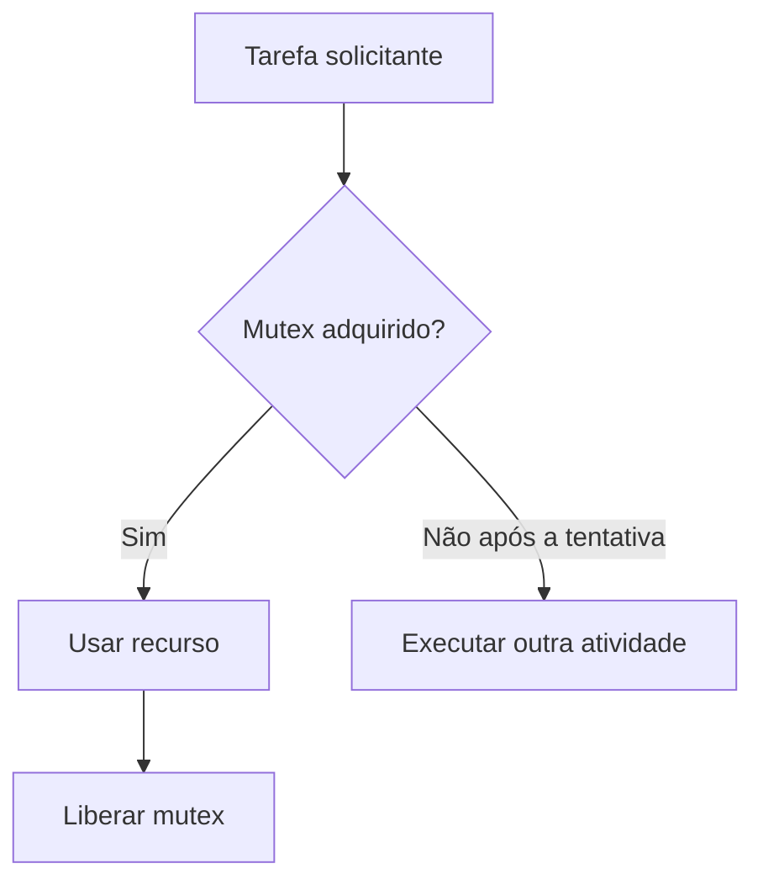

# Atividade 7 — Se estiver ocupado, faça outra coisa

[Voltar ao índice](../README.md)

**Situação:** registros organizados; revisão e complementação pendentes.

## 1. Objetivo

Comparar a espera indefinida, a tentativa imediata e a espera limitada para adquirir um recurso.

## 2. Configuração

| Item | Configuração |
|---|---|
| Recurso | Recurso compartilhado; identificar no projeto |
| Mutex | Nome e criação a incluir |
| Cenários | osWaitForever e timeouts 0, 10, 7 e 3 |
| Tarefas | Nomes, prioridades e tempos de retenção a incluir |

Consultar também o [ambiente comum](ambiente.md). Projeto correspondente: `projetos/atividade-07/` (a adicionar).

## 3. Diagrama da aplicação

Fluxo conceitual para tentativa imediata ou espera limitada. Os nomes das tarefas e o recurso ainda precisam ser associados ao projeto.



## 4. Implementação e experimentos

### saída usando osWaitForever

```text
[30 ms] Mutex adquirido. Fazendo uso do recurso compartilhado!
[240 ms] Mutex adquirido. Fazendo uso do recurso compartilhado!
[450 ms] Mutex adquirido. Fazendo uso do recurso compartilhado!
[660 ms] Mutex adquirido. Fazendo uso do recurso compartilhado!
[870 ms] Mutex adquirido. Fazendo uso do recurso compartilhado!
[1080 ms] Mutex adquirido. Fazendo uso do recurso compartilhado!
[1290 ms] Mutex adquirido. Fazendo uso do recurso compartilhado!
[1500 ms] Mutex adquirido. Fazendo uso do recurso compartilhado!
[1710 ms] Mutex adquirido. Fazendo uso do recurso compartilhado!
[1920 ms] Mutex adquirido. Fazendo uso do recurso compartilhado!
[2130 ms] Mutex adquirido. Fazendo uso do recurso compartilhado!
[2340 ms] Mutex adquirido. Fazendo uso do recurso compartilhado!
```

Trecho inicial. [Registro completo disponível no rascunho](logs/atividade-07-registro-01.txt).

### saída usando timeout = 0

```text
[0 ms] Mutex ocupado. Fazendo outra coisa...
[204 ms] Mutex ocupado. Fazendo outra coisa...
[408 ms] Mutex ocupado. Fazendo outra coisa...
[612 ms] Mutex ocupado. Fazendo outra coisa...
[816 ms] Mutex ocupado. Fazendo outra coisa...
[1020 ms] Mutex ocupado. Fazendo outra coisa...
[1224 ms] Mutex adquirido. Fazendo uso do recurso compartilhado!
[1429 ms] Mutex ocupado. Fazendo outra coisa...
[1633 ms] Mutex ocupado. Fazendo outra coisa...
[1837 ms] Mutex ocupado. Fazendo outra coisa...
[2041 ms] Mutex ocupado. Fazendo outra coisa...
[2245 ms] Mutex ocupado. Fazendo outra coisa...
```

Trecho inicial. [Registro completo disponível no rascunho](logs/atividade-07-registro-02.txt).

### Utilizando timeout = 10

```text
[0 ms] Mutex ocupado. Fazendo outra coisa...
[10 ms] Mutex ocupado. Fazendo outra coisa...
[224 ms] Mutex ocupado. Fazendo outra coisa...
[438 ms] Mutex ocupado. Fazendo outra coisa...
[652 ms] Mutex ocupado. Fazendo outra coisa...
[866 ms] Mutex ocupado. Fazendo outra coisa...
[1080 ms] Mutex adquirido. Fazendo uso do recurso compartilhado!
[1290 ms] Mutex adquirido. Fazendo uso do recurso compartilhado!
[1500 ms] Mutex adquirido. Fazendo uso do recurso compartilhado!
[1710 ms] Mutex adquirido. Fazendo uso do recurso compartilhado!
[1920 ms] Mutex adquirido. Fazendo uso do recurso compartilhado!
[2130 ms] Mutex adquirido. Fazendo uso do recurso compartilhado!
[2340 ms] Mutex adquirido. Fazendo uso do recurso compartilhado!
[2550 ms] Mutex adquirido. Fazendo uso do recurso compartilhado!
[2760 ms] Mutex adquirido. Fazendo uso do recurso compartilhado!
```

[Registro completo disponível no rascunho](logs/atividade-07-registro-03.txt).

### Utilizando timeout = 7

```text
[10 ms] Mutex ocupado. Fazendo outra coisa...
[7 ms] Mutex ocupado. Fazendo outra coisa...
[218 ms] Mutex ocupado. Fazendo outra coisa...
[429 ms] Mutex ocupado. Fazendo outra coisa...
[640 ms] Mutex ocupado. Fazendo outra coisa...
[851 ms] Mutex ocupado. Fazendo outra coisa...
[1062 ms] Mutex ocupado. Fazendo outra coisa...
[1273 ms] Mutex ocupado. Fazendo outra coisa...
[1484 ms] Mutex ocupado. Fazendo outra coisa...
[1695 ms] Mutex ocupado. Fazendo outra coisa...
[1906 ms] Mutex ocupado. Fazendo outra coisa...
[2117 ms] Mutex ocupado. Fazendo outra coisa...
```

Trecho inicial. [Registro completo disponível no rascunho](logs/atividade-07-registro-04.txt).

### Utilizando timeout = 3

```text
[3 ms] Mutex ocupado. Fazendo outra coisa...
[207 ms] Mutex adquirido. Fazendo uso do recurso compartilhado!
[415 ms] Mutex ocupado. Fazendo outra coisa...
[622 ms] Mutex ocupado. Fazendo outra coisa...
[829 ms] Mutex ocupado. Fazendo outra coisa...
[1036 ms] Mutex ocupado. Fazendo outra coisa...
[1243 ms] Mutex ocupado. Fazendo outra coisa...
[1450 ms] Mutex ocupado. Fazendo outra coisa...
[1657 ms] Mutex ocupado. Fazendo outra coisa...
[1864 ms] Mutex ocupado. Fazendo outra coisa...
[2071 ms] Mutex ocupado. Fazendo outra coisa...
[2275 ms] Mutex adquirido. Fazendo uso do recurso compartilhado!
```

Trecho inicial. [Registro completo disponível no rascunho](logs/atividade-07-registro-05.txt).

## 5. Análise dos resultados

**Questão:** Em uma aplicação de controle em tempo real, por que pode ser inadequado bloquear uma tarefa indefinidamente esperando por um recurso que não é essencial para sua operação principal?

**Pendente:** desenvolver a resposta relacionando os conceitos aos resultados registrados.

## 6. Conclusão

**Pendente:** consolidar a conclusão após resolver os itens de revisão abaixo.

## 7. Pendências e verificações

- [ ] Incluir o código dos cenários e explicar o instante em que o timestamp é obtido.
- [ ] No cenário timeout 7, o registro começa com 10 ms seguido de 7 ms. A sequência foi preservada; verificar a origem dessa ordem antes de interpretar os tempos.
- [ ] Preencher a comparação dos cenários e a resposta à questão de análise.
- [ ] Adicionar capturas reais do terminal serial.
- [ ] Vincular o projeto STM32CubeIDE e conferir a correspondência entre código, configuração e resultados.
