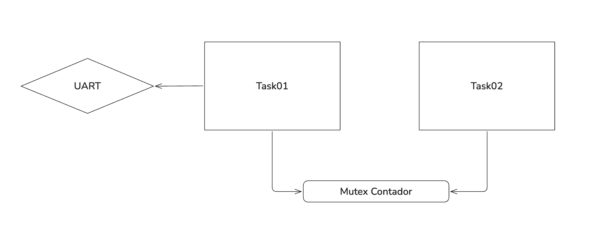

# Atividade 7 — Se estiver ocupado, faça outra coisa

## 1. Objetivo

Comparar a espera indefinida, a tentativa imediata e a espera limitada para adquirir um recurso.

## 2. Diagrama



## 3. Implementação e experimentos

```c
void Task01_fun(void *argument)
{
  /* USER CODE BEGIN 5 */
  /* Infinite loop */
  for(;;)
  {
    if(osMutexAcquire(recursoMutexHandle, osWaitForever) == osOK){
    	printf("[%lu ms] Mutex adquirido. Fazendo uso do recurso compartilhado!\r\n", osKernelGetTickCount());
	osMutexRelease(recursoMutexHandle);
    }
    else {
    	printf("[%lu ms] Mutex ocupado. Fazendo outra coisa...\r\n", osKernelGetTickCount());
    }
    osDelay(200);
  }
  /* USER CODE END 5 */
}
```

```c
void Task02_fun(void *argument)
{
  /* USER CODE BEGIN Task02_fun */
  /* Infinite loop */
  for(;;)
  {
	osMutexAcquire(recursoMutexHandle, osWaitForever);
	osDelay(30);
	osMutexRelease(recursoMutexHandle);
	osDelay(5);
  }
  /* USER CODE END Task02_fun */
}
```

### saída usando osWaitForever

```text
[30 ms] Mutex adquirido. Fazendo uso do recurso compartilhado!
[240 ms] Mutex adquirido. Fazendo uso do recurso compartilhado!
[450 ms] Mutex adquirido. Fazendo uso do recurso compartilhado!
[660 ms] Mutex adquirido. Fazendo uso do recurso compartilhado!
[870 ms] Mutex adquirido. Fazendo uso do recurso compartilhado!
[1080 ms] Mutex adquirido. Fazendo uso do recurso compartilhado!
[1290 ms] Mutex adquirido. Fazendo uso do recurso compartilhado!
[1500 ms] Mutex adquirido. Fazendo uso do recurso compartilhado!
[1710 ms] Mutex adquirido. Fazendo uso do recurso compartilhado!
[1920 ms] Mutex adquirido. Fazendo uso do recurso compartilhado!
[2130 ms] Mutex adquirido. Fazendo uso do recurso compartilhado!
[2340 ms] Mutex adquirido. Fazendo uso do recurso compartilhado!
[2550 ms] Mutex adquirido. Fazendo uso do recurso compartilhado!
[2760 ms] Mutex adquirido. Fazendo uso do recurso compartilhado!
[2970 ms] Mutex adquirido. Fazendo uso do recurso compartilhado!
[3180 ms] Mutex adquirido. Fazendo uso do recurso compartilhado!
[3390 ms] Mutex adquirido. Fazendo uso do recurso compartilhado!
[3600 ms] Mutex adquirido. Fazendo uso do recurso compartilhado!
[3810 ms] Mutex adquirido. Fazendo uso do recurso compartilhado!
[4020 ms] Mutex adquirido. Fazendo uso do recurso compartilhado!
[4230 ms] Mutex adquirido. Fazendo uso do recurso compartilhado!
[4440 ms] Mutex adquirido. Fazendo uso do recurso compartilhado!
[4650 ms] Mutex adquirido. Fazendo uso do recurso compartilhado!
[4860 ms] Mutex adquirido. Fazendo uso do recurso compartilhado!
[5070 ms] Mutex adquirido. Fazendo uso do recurso compartilhado!
[5280 ms] Mutex adquirido. Fazendo uso do recurso compartilhado!

```

### saída usando timeout = 0

```text
[0 ms] Mutex ocupado. Fazendo outra coisa...
[204 ms] Mutex ocupado. Fazendo outra coisa...
[408 ms] Mutex ocupado. Fazendo outra coisa...
[612 ms] Mutex ocupado. Fazendo outra coisa...
[816 ms] Mutex ocupado. Fazendo outra coisa...
[1020 ms] Mutex ocupado. Fazendo outra coisa...
[1224 ms] Mutex adquirido. Fazendo uso do recurso compartilhado!
[1429 ms] Mutex ocupado. Fazendo outra coisa...
[1633 ms] Mutex ocupado. Fazendo outra coisa...
[1837 ms] Mutex ocupado. Fazendo outra coisa...
[2041 ms] Mutex ocupado. Fazendo outra coisa...
[2245 ms] Mutex ocupado. Fazendo outra coisa...
[2449 ms] Mutex ocupado. Fazendo outra coisa...
[2653 ms] Mutex ocupado. Fazendo outra coisa...
[2857 ms] Mutex ocupado. Fazendo outra coisa...
[3061 ms] Mutex ocupado. Fazendo outra coisa...
[3265 ms] Mutex ocupado. Fazendo outra coisa...
[3469 ms] Mutex adquirido. Fazendo uso do recurso compartilhado!
[3674 ms] Mutex ocupado. Fazendo outra coisa...
[3878 ms] Mutex ocupado. Fazendo outra coisa...
[4082 ms] Mutex ocupado. Fazendo outra coisa...
[4286 ms] Mutex ocupado. Fazendo outra coisa...
[4490 ms] Mutex ocupado. Fazendo outra coisa...
[4694 ms] Mutex ocupado. Fazendo outra coisa...
[4898 ms] Mutex ocupado. Fazendo outra coisa...
[5102 ms] Mutex ocupado. Fazendo outra coisa...
[5306 ms] Mutex ocupado. Fazendo outra coisa...
[5510 ms] Mutex ocupado. Fazendo outra coisa...
[5714 ms] Mutex adquirido. Fazendo uso do recurso compartilhado!

```

### Utilizando timeout = 10

```text
[0 ms] Mutex ocupado. Fazendo outra coisa...
[10 ms] Mutex ocupado. Fazendo outra coisa...
[224 ms] Mutex ocupado. Fazendo outra coisa...
[438 ms] Mutex ocupado. Fazendo outra coisa...
[652 ms] Mutex ocupado. Fazendo outra coisa...
[866 ms] Mutex ocupado. Fazendo outra coisa...
[1080 ms] Mutex adquirido. Fazendo uso do recurso compartilhado!
[1290 ms] Mutex adquirido. Fazendo uso do recurso compartilhado!
[1500 ms] Mutex adquirido. Fazendo uso do recurso compartilhado!
[1710 ms] Mutex adquirido. Fazendo uso do recurso compartilhado!
[1920 ms] Mutex adquirido. Fazendo uso do recurso compartilhado!
[2130 ms] Mutex adquirido. Fazendo uso do recurso compartilhado!
[2340 ms] Mutex adquirido. Fazendo uso do recurso compartilhado!
[2550 ms] Mutex adquirido. Fazendo uso do recurso compartilhado!
[2760 ms] Mutex adquirido. Fazendo uso do recurso compartilhado!
```

### Utilizando timeout = 7

```text
[7 ms] Mutex ocupado. Fazendo outra coisa...
[218 ms] Mutex ocupado. Fazendo outra coisa...
[429 ms] Mutex ocupado. Fazendo outra coisa...
[640 ms] Mutex ocupado. Fazendo outra coisa...
[851 ms] Mutex ocupado. Fazendo outra coisa...
[1062 ms] Mutex ocupado. Fazendo outra coisa...
[1273 ms] Mutex ocupado. Fazendo outra coisa...
[1484 ms] Mutex ocupado. Fazendo outra coisa...
[1695 ms] Mutex ocupado. Fazendo outra coisa...
[1906 ms] Mutex ocupado. Fazendo outra coisa...
[2117 ms] Mutex ocupado. Fazendo outra coisa...
[2328 ms] Mutex ocupado. Fazendo outra coisa...
[2539 ms] Mutex ocupado. Fazendo outra coisa...
[2750 ms] Mutex ocupado. Fazendo outra coisa...
[2961 ms] Mutex ocupado. Fazendo outra coisa...
[3172 ms] Mutex ocupado. Fazendo outra coisa...
[3383 ms] Mutex ocupado. Fazendo outra coisa...
[3594 ms] Mutex ocupado. Fazendo outra coisa...
[3805 ms] Mutex ocupado. Fazendo outra coisa...
[4016 ms] Mutex ocupado. Fazendo outra coisa...
[4227 ms] Mutex ocupado. Fazendo outra coisa...
[4438 ms] Mutex ocupado. Fazendo outra coisa...
[4649 ms] Mutex ocupado. Fazendo outra coisa...
[4860 ms] Mutex adquirido. Fazendo uso do recurso compartilhado!
[5070 ms] Mutex adquirido. Fazendo uso do recurso compartilhado!
[5280 ms] Mutex adquirido. Fazendo uso do recurso compartilhado!
[5490 ms] Mutex adquirido. Fazendo uso do recurso compartilhado!
[5700 ms] Mutex adquirido. Fazendo uso do recurso compartilhado!
[5910 ms] Mutex adquirido. Fazendo uso do recurso compartilhado!
[6120 ms] Mutex adquirido. Fazendo uso do recurso compartilhado!
[6330 ms] Mutex adquirido. Fazendo uso do recurso compartilhado!

```

### Utilizando timeout = 3

```text
[3 ms] Mutex ocupado. Fazendo outra coisa...
[207 ms] Mutex adquirido. Fazendo uso do recurso compartilhado!
[415 ms] Mutex ocupado. Fazendo outra coisa...
[622 ms] Mutex ocupado. Fazendo outra coisa...
[829 ms] Mutex ocupado. Fazendo outra coisa...
[1036 ms] Mutex ocupado. Fazendo outra coisa...
[1243 ms] Mutex ocupado. Fazendo outra coisa...
[1450 ms] Mutex ocupado. Fazendo outra coisa...
[1657 ms] Mutex ocupado. Fazendo outra coisa...
[1864 ms] Mutex ocupado. Fazendo outra coisa...
[2071 ms] Mutex ocupado. Fazendo outra coisa...
[2275 ms] Mutex adquirido. Fazendo uso do recurso compartilhado!
[2483 ms] Mutex ocupado. Fazendo outra coisa...
[2690 ms] Mutex ocupado. Fazendo outra coisa...
[2897 ms] Mutex ocupado. Fazendo outra coisa...
[3104 ms] Mutex ocupado. Fazendo outra coisa...
[3311 ms] Mutex ocupado. Fazendo outra coisa...
[3518 ms] Mutex ocupado. Fazendo outra coisa...
[3725 ms] Mutex ocupado. Fazendo outra coisa...
[3932 ms] Mutex ocupado. Fazendo outra coisa...
[4139 ms] Mutex ocupado. Fazendo outra coisa...
[4343 ms] Mutex adquirido. Fazendo uso do recurso compartilhado!
[4551 ms] Mutex ocupado. Fazendo outra coisa...
[4758 ms] Mutex ocupado. Fazendo outra coisa...
[4965 ms] Mutex ocupado. Fazendo outra coisa...
[5172 ms] Mutex ocupado. Fazendo outra coisa...
[5379 ms] Mutex ocupado. Fazendo outra coisa...
[5586 ms] Mutex ocupado. Fazendo outra coisa...
[5793 ms] Mutex ocupado. Fazendo outra coisa...
[6000 ms] Mutex ocupado. Fazendo outra coisa...
[6207 ms] Mutex ocupado. Fazendo outra coisa...
[6411 ms] Mutex adquirido. Fazendo uso do recurso compartilhado!
[6619 ms] Mutex ocupado. Fazendo outra coisa...
[6826 ms] Mutex ocupado. Fazendo outra coisa...
```

## 4. Análise dos resultados

**Questão:** Em uma aplicação de controle em tempo real, por que pode ser inadequado bloquear uma tarefa indefinidamente esperando por um recurso que não é essencial para sua operação principal?

Porque pode ocorrer uma situação de starvation e o sistema como um todo ser paralizado devido ao fato de essa tarefa estar presa aguardando o recurso não-essencial.