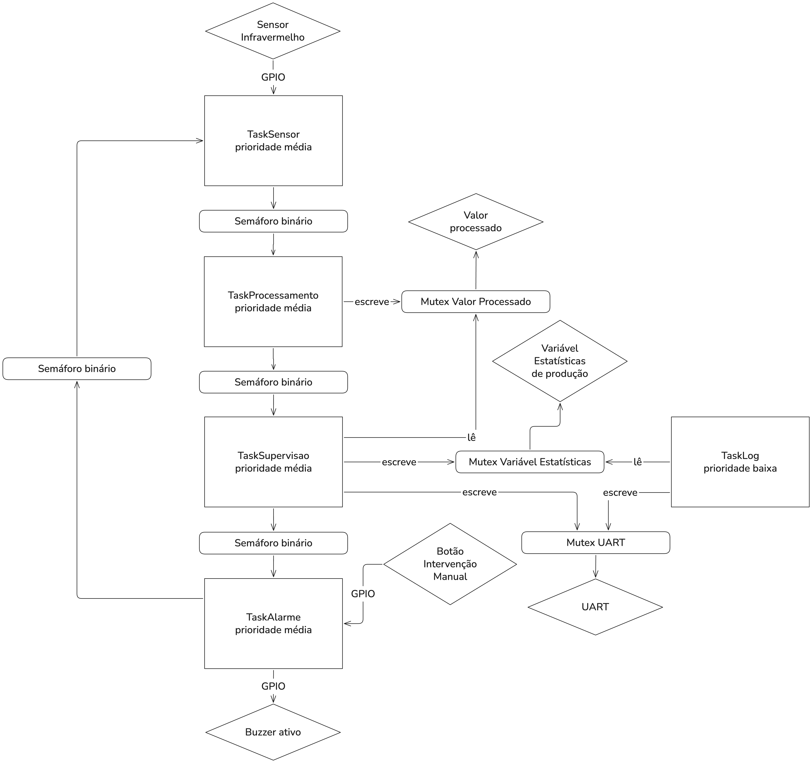

# Atividade 8 — Mini Sistema Industrial

## 1. Objetivo

Integrar prioridades, semáforos e mutex em uma aplicação de tempo real que simula uma esteira industrial com detecção e processamento de peças, supervisão, registro de eventos (log) e tratamento de alarmes.

## 2. Diagrama da aplicação



## 3. Definição da arquitetura

### Plataforma

| Recurso | Pino | Configuração |
|---|---|---|
| Sensor infravermelho (`IR_SENSOR_PIN`) | PA5 | Entrada, sem pull. Ativo em nível baixo (0 = peça detectada) |
| Buzzer ativo (`BUZZER_PIN`) | PA4 | Saída. Nível alto liga o buzzer |
| Botão K1 (`BTN_K1`) | PE3 | Entrada com pull-up. Pressionado = 0 |
| USART1 | PA9 (TX) / PA10 (RX) | 115200 bps, 8N1. `printf` redirecionado por `_write()` |

### Tarefas e prioridades

| Tarefa | Prioridade | Bloqueia em |
|---|---|---|
| `TaskSensor` | `osPriorityNormal` | `semaforoOperacao` e `osDelay` |
| `TaskProcessamento` | `osPriorityNormal` | `semaforoSensor` |
| `TaskSupervisao` | `osPriorityNormal` | `semaforoSupervisao` |
| `TaskLog` | `osPriorityLow` | `osDelay(10000)` |
| `TaskAlarme` | `osPriorityLow` | `semaforoAlarme` e `osDelay(50)` |

As três tarefas do fluxo da peça (sensor → processamento → supervisão) formam uma cascata: cada uma só executa quando a anterior libera o semáforo correspondente, de modo que a ordem de execução é determinada pela sinalização e não pela prioridade relativa. `TaskLog` não possui requisito rígido de tempo e `TaskAlarme` só precisa ser acordada em caso de falha; ambas ficam em prioridade baixa e executam sempre que as tarefas de prioridade normal estão bloqueadas.

### Semáforos

| Semáforo | Valor inicial | Função |
|---|---|---|
| `semaforoSensor` | 0 | `TaskSensor` sinaliza peça detectada para `TaskProcessamento` |
| `semaforoSupervisao` | 0 | `TaskProcessamento` sinaliza resultado pronto para `TaskSupervisao` |
| `semaforoAlarme` | 0 | `TaskSupervisao` sinaliza falha para `TaskAlarme` |
| `semaforoOperacao` | 1 | Permissão de operação da esteira. `TaskAlarme` o retém enquanto o alarme está ativo |

### Mutex

| Mutex | Recurso protegido | Tarefas que o utilizam |
|---|---|---|
| `mutexValorProcessado` | variável `valorProcessado` | `TaskProcessamento` (escrita), `TaskSupervisao` (leitura) |
| `mutexVariavelEstatisticas` | contadores `pecasOK` e `pecasFalha` | `TaskSupervisao` (escrita), `TaskLog` (leitura) |
| `mutexUart` | transmissão pela USART1 | `TaskSupervisao`, `TaskLog` |

### Informações apresentadas pela UART

- Uma linha por peça processada, com o valor calculado, ou uma mensagem de erro quando o valor é maior ou igual a 95 (aproximadamente 5% das peças, pois o valor é `rand() % 100`).
- Um sumário a cada 10 s com o total de peças processadas e de erros registrados.

## 4. Implementação e experimentos

### Código das tarefas

```c
/* USER CODE BEGIN PV */
int valorProcessado = 0;
int pecasOK = 0;
int pecasFalha = 0;
/* USER CODE END PV */
```

```c
void TaskSensor_fun(void *argument)
{
  /* USER CODE BEGIN 5 */
  /* Infinite loop */
  for(;;)
  {
    osSemaphoreAcquire(semaforoOperacaoHandle, osWaitForever); // Permissão para operar

    if(HAL_GPIO_ReadPin(IR_SENSOR_PIN_GPIO_Port, IR_SENSOR_PIN_Pin) == GPIO_PIN_RESET){ // Sensor ativo em nível baixo
      osSemaphoreRelease(semaforoSensorHandle);
      osDelay(100);
      while(HAL_GPIO_ReadPin(IR_SENSOR_PIN_GPIO_Port, IR_SENSOR_PIN_Pin) == GPIO_PIN_RESET);
    }

    osSemaphoreRelease(semaforoOperacaoHandle);
    osDelay(10);
  }
  /* USER CODE END 5 */
}
```

```c
void TaskProcessamento_fun(void *argument)
{
  /* USER CODE BEGIN TaskProcessamento_fun */
  /* Infinite loop */
  for(;;)
  {
    if(osSemaphoreAcquire(semaforoSensorHandle, osWaitForever) == osOK){

      osMutexAcquire(mutexValorProcessadoHandle, osWaitForever);
      valorProcessado = (rand() % 100);
      osMutexRelease(mutexValorProcessadoHandle);

      osSemaphoreRelease(semaforoSupervisaoHandle);
    }
  }
  /* USER CODE END TaskProcessamento_fun */
}
```

```c
void TaskSupervisao_fun(void *argument)
{
  /* USER CODE BEGIN TaskSupervisao_fun */
  int valorProcessadoLocal = 0;
  /* Infinite loop */
  for(;;)
  {
    if(osSemaphoreAcquire(semaforoSupervisaoHandle, osWaitForever) == osOK){

      osMutexAcquire(mutexValorProcessadoHandle, osWaitForever);
      valorProcessadoLocal = valorProcessado;
      osMutexRelease(mutexValorProcessadoHandle);

      // Ordem de aquisição padronizada: UART primeiro, estatísticas depois
      osMutexAcquire(mutexUartHandle, osWaitForever);
      osMutexAcquire(mutexVariavelEstatisticasHandle, osWaitForever);

      if(valorProcessadoLocal >= 95){
        pecasFalha++;
        printf("[%lu ms] ERRO DETECTADO - Necessária intervenção manual\r\n", osKernelGetTickCount());
        osSemaphoreRelease(semaforoAlarmeHandle);
      } else {
        pecasOK++;
        printf("[%lu ms] Peça processada no valor de %d\r\n", osKernelGetTickCount(), valorProcessadoLocal);
      }

      osMutexRelease(mutexUartHandle);
      osMutexRelease(mutexVariavelEstatisticasHandle);
    }
  }
  /* USER CODE END TaskSupervisao_fun */
}
```

```c
void TaskLog_fun(void *argument)
{
  /* USER CODE BEGIN TaskLog_fun */
  /* Infinite loop */
  for(;;)
  {
    // Mesma ordem de aquisição de TaskSupervisao
    osMutexAcquire(mutexUartHandle, osWaitForever);
    osMutexAcquire(mutexVariavelEstatisticasHandle, osWaitForever);
    printf("[%lu ms][LOG] PEÇAS PROCESSADAS: %d ERROS REGISTRADOS: %d\r\n", osKernelGetTickCount(), pecasOK, pecasFalha);
    osMutexRelease(mutexUartHandle);
    osMutexRelease(mutexVariavelEstatisticasHandle);
    osDelay(10000);
  }
  /* USER CODE END TaskLog_fun */
}
```

```c
void TaskAlarme_fun(void *argument)
{
  /* USER CODE BEGIN TaskAlarme_fun */
  HAL_GPIO_WritePin(BUZZER_PIN_GPIO_Port, BUZZER_PIN_Pin, 0);
  /* Infinite loop */
  for(;;)
  {
    if(osSemaphoreAcquire(semaforoAlarmeHandle, osWaitForever) == osOK){
      osSemaphoreAcquire(semaforoOperacaoHandle, osWaitForever); // Retém a permissão de operação
      HAL_GPIO_WritePin(BUZZER_PIN_GPIO_Port, BUZZER_PIN_Pin, 1);

      while(HAL_GPIO_ReadPin(BTN_K1_GPIO_Port, BTN_K1_Pin) == 1){
        osDelay(50);
      }

      HAL_GPIO_WritePin(BUZZER_PIN_GPIO_Port, BUZZER_PIN_Pin, 0);
      osSemaphoreRelease(semaforoOperacaoHandle); // Retoma a operação
    }
  }
  /* USER CODE END TaskAlarme_fun */
}
```

### Funcionamento normal

**Saída registrada:**

```text
[0 ms][LOG] PEÇAS PROCESSADAS: 0 ERROS REGISTRADOS: 0
[3190 ms] Peça processada no valor de 0
[4000 ms] Peça processada no valor de 33
[4330 ms] Peça processada no valor de 43
[4580 ms] Peça processada no valor de 62
[4810 ms] Peça processada no valor de 29
[8350 ms] Peça processada no valor de 0
[9510 ms] Peça processada no valor de 8
[9880 ms] Peça processada no valor de 52
[10004 ms][LOG] PEÇAS PROCESSADAS: 8 ERROS REGISTRADOS: 0
[11880 ms] Peça processada no valor de 56
[12160 ms] Peça processada no valor de 56
[12570 ms] Peça processada no valor de 19
[12780 ms] Peça processada no valor de 11
[13140 ms] Peça processada no valor de 51
[13430 ms] Peça processada no valor de 43
[13660 ms] Peça processada no valor de 5
[13910 ms] Peça processada no valor de 8
[14170 ms] Peça processada no valor de 93
[14360 ms] Peça processada no valor de 30
[14570 ms] Peça processada no valor de 66
[14750 ms] Peça processada no valor de 69
[14950 ms] Peça processada no valor de 32
[15070 ms] Peça processada no valor de 17
[15230 ms] Peça processada no valor de 47
[15360 ms] Peça processada no valor de 72
[15500 ms] Peça processada no valor de 68
[15610 ms] Peça processada no valor de 80
[15750 ms] Peça processada no valor de 23
[15880 ms] Peça processada no valor de 49
[16000 ms] Peça processada no valor de 92
[16120 ms] Peça processada no valor de 64
[16250 ms] Peça processada no valor de 69
[16476 ms] Peça processada no valor de 51
[16596 ms] Peça processada no valor de 27
[16726 ms] Peça processada no valor de 90
[16836 ms] Peça processada no valor de 24
[16966 ms] Peça processada no valor de 35
[17186 ms] Peça processada no valor de 20
[17296 ms] Peça processada no valor de 44
[17426 ms] Peça processada no valor de 10
[17566 ms] Peça processada no valor de 62
[17696 ms] Peça processada no valor de 84
[17856 ms] Peça processada no valor de 63
[17976 ms] Peça processada no valor de 1
[18086 ms] Peça processada no valor de 10
[18326 ms] Peça processada no valor de 36
[18566 ms] Peça processada no valor de 76
[18716 ms] Peça processada no valor de 31
[18943 ms] Peça processada no valor de 29
[19063 ms] ERRO DETECTADO - Necessária intervenção manual
[20009 ms][LOG] PEÇAS PROCESSADAS: 48 ERROS REGISTRADOS: 1
[30014 ms][LOG] PEÇAS PROCESSADAS: 48 ERROS REGISTRADOS: 1
[34623 ms] Peça processada no valor de 75
[35314 ms] Peça processada no valor de 91
[37054 ms] Peça processada no valor de 90
[38164 ms] Peça processada no valor de 44
[38484 ms] Peça processada no valor de 34
[38904 ms] Peça processada no valor de 25
[39294 ms] Peça processada no valor de 29
[40019 ms][LOG] PEÇAS PROCESSADAS: 55 ERROS REGISTRADOS: 1
[42124 ms] Peça processada no valor de 30
[42554 ms] Peça processada no valor de 27
[42954 ms] Peça processada no valor de 26
[43534 ms] Peça processada no valor de 43
[43774 ms] Peça processada no valor de 34
[44324 ms] Peça processada no valor de 4
[46504 ms] Peça processada no valor de 60
[46644 ms] Peça processada no valor de 49
[46784 ms] Peça processada no valor de 20
[47337 ms] Peça processada no valor de 56
[47487 ms] Peça processada no valor de 32
[50024 ms][LOG] PEÇAS PROCESSADAS: 66 ERROS REGISTRADOS: 1
```

Descrição: a cada peça detectada pelo sensor, `TaskSensor` libera `semaforoSensor`, `TaskProcessamento` calcula o valor e libera `semaforoSupervisao`, e `TaskSupervisao` imprime o resultado. `TaskLog` imprime o sumário imediatamente na inicialização e depois a cada 10 s. Quando o valor sorteado é maior ou igual a 95, `TaskSupervisao` registra o erro e libera `semaforoAlarme`; `TaskAlarme` então retém `semaforoOperacao`, aciona o buzzer e aguarda o botão K1. Durante esse intervalo `TaskSensor` permanece em estado Blocked e nenhuma nova peça é aceita.

### Desafio: Possíveis problemas de concorrência

#### Problema 1 — Deadlock entre mutex

Na versão com o problema, `TaskSupervisao` e `TaskLog` adquirem os mutex em ordens opostas:

```c
// TaskSupervisao (versão com o problema)
osMutexAcquire(mutexVariavelEstatisticasHandle, osWaitForever);
osMutexAcquire(mutexUartHandle, osWaitForever);
```

```c
// TaskLog (versão com o problema)
osMutexAcquire(mutexUartHandle, osWaitForever);
osMutexAcquire(mutexVariavelEstatisticasHandle, osWaitForever);
```

Se `TaskLog` adquire `mutexUart` e é preemptada por `TaskSupervisao` antes de adquirir `mutexVariavelEstatisticas`, `TaskSupervisao` obtém `mutexVariavelEstatisticas` e passa a esperar `mutexUart`. `TaskLog` retoma, passa a esperar `mutexVariavelEstatisticas`, e as duas ficam em Blocked indefinidamente, cada uma aguardando o mutex retido pela outra.

**Solução:** padronizar a ordem de aquisição. As duas tarefas passam a adquirir sempre `mutexUart` primeiro e `mutexVariavelEstatisticas` depois, conforme o código apresentado acima.

#### Problema 2 — Esteira não para após o alarme

Na versão com o problema, `TaskSensor` não adquiria `semaforoOperacao`. `TaskAlarme` acionava o buzzer, mas `TaskSensor` continuava lendo o pino e liberando `semaforoSensor`, de modo que novas peças continuavam entrando no pipeline durante o alarme.

```c
// TaskSensor (versão com o problema)
for(;;)
{
  if(HAL_GPIO_ReadPin(IR_SENSOR_PIN_GPIO_Port, IR_SENSOR_PIN_Pin) == GPIO_PIN_RESET){
    osSemaphoreRelease(semaforoSensorHandle);
    osDelay(100);
    while(HAL_GPIO_ReadPin(IR_SENSOR_PIN_GPIO_Port, IR_SENSOR_PIN_Pin) == GPIO_PIN_RESET);
  }
  osDelay(10);
}
```

**Solução:** o semáforo binário `semaforoOperacao`, inicializado em 1, funciona como permissão de operação. `TaskSensor` o adquire antes de ler o pino e o libera ao final de cada ciclo. Quando há erro, `TaskAlarme` adquire esse semáforo e não o libera até o botão K1 ser pressionado, o que mantém `TaskSensor` em Blocked durante o alarme.

## 5. Análise dos resultados

### Requisitos e mecanismos

| Requisito | Mecanismo | Justificativa |
|---|---|---|
| Definir as prioridades das tarefas | Prioridade | Fluxo da peça em `osPriorityNormal`; `TaskLog` em `osPriorityLow`, pois não têm requisito rígido de tempo e executam quando as demais estão bloqueadas |
| Acordar a próxima etapa quando há dado ou evento | Semáforo binário | `semaforoSensor`, `semaforoSupervisao` e `semaforoAlarme` mantêm as tarefas em Blocked até serem sinalizadas, sem polling. Quem libera não é quem adquire |
| Permitir ou interromper a operação da esteira | Semáforo binário | `semaforoOperacao` autoriza `TaskSensor` a operar; `TaskAlarme` o retém para parar a esteira e o libera ao fim do alarme |
| Proteger variável compartilhada de resultado | Mutex | `mutexValorProcessado` garante acesso exclusivo a `valorProcessado` entre `TaskProcessamento` e `TaskSupervisao` |
| Proteger contadores de estatística | Mutex | `mutexVariavelEstatisticas` evita leitura inconsistente de `pecasOK` e `pecasFalha` por `TaskLog` durante a atualização por `TaskSupervisao` |
| Controlar acesso à UART | Mutex | `mutexUart` mantém a integridade das mensagens de `TaskSupervisao` e `TaskLog` |
| Evitar deadlock | Ordem de aquisição | Aquisição sempre na ordem `mutexUart` → `mutexVariavelEstatisticas` nas duas tarefas |
| Tarefas que podem ficar bloqueadas | Semáforo e `osDelay` | Todas as tarefas bloqueiam em semáforo ou `osDelay`, com a exceção da espera ativa em `TaskSensor` descrita nas observações |
| Informações pela UART | Mutex | Uma linha por peça processada ou erro e um sumário a cada 10 s |

# Análise final

### Tabela de mecanismos

| Problema | Prioridade | Semáforo | Mutex |
|---|:---:|:---:|:---:|
| Definir qual tarefa deve executar primeiro | X | | |
| Esperar pela ocorrência de um evento | | X | |
| Proteger uma variável compartilhada | | | X |
| Controlar acesso exclusivo à UART | | | X |
| Representar três recursos disponíveis | | X | |
| Atender rapidamente uma tarefa crítica | X | | |
| Sincronizar sensor e processamento | | X | |

### Questão final

**Questão:** Diante de um problema em uma aplicação FreeRTOS, como decidir se a solução exige alterar a prioridade de uma tarefa, utilizar um semáforo ou proteger um recurso utilizando mutex?

A decisão depende da natureza do problema. Caso seja um problema de urgência ou latência, deve-se alterar as prioridades de cada tarefa. Caso seja de sincronização no tempo, utiliza-se semáforos. E caso seja um problema de garantir a integridade de um recurso crítico, utiliza-se mutexes.

### Diferença entre prioridade, semáforo e mutex

1. **Prioridade:** Define a ordem em que as tarefas em Ready recebem o processador. Exemplo: Tarefas que exigem baixa latência como controle de motores em um sistema industrial terão prioridade alta, enquanto tarefas menos essenciais, como as responsáveis por interfaces gráficas ou sistemas de log ficam com prioridades baixas para evitar tomar o tempo em processamento de tarefas que, caso falhem, possam causar prejuízos significativos.
2. **Semáforo:** Autoriza uma tarefa a prosseguir quando um evento ocorre ou quando há unidades disponíveis de um recurso. Exemplo: Para evitar o gasto desnecessário de CPU por polling, uma tarefa que consome um dado fornecido por outra tarefa responsável por processar dados de um ADC permanece bloqueada até esse dado estar pronto.
3. **Mutex:** concede a uma tarefa por vez o uso de um recurso compartilhado. Exemplo: um barramento I2C usado por tarefas que leem sensores diferentes, onde cada transação completa precisa ocorrer sem interferência de outra tarefa.


